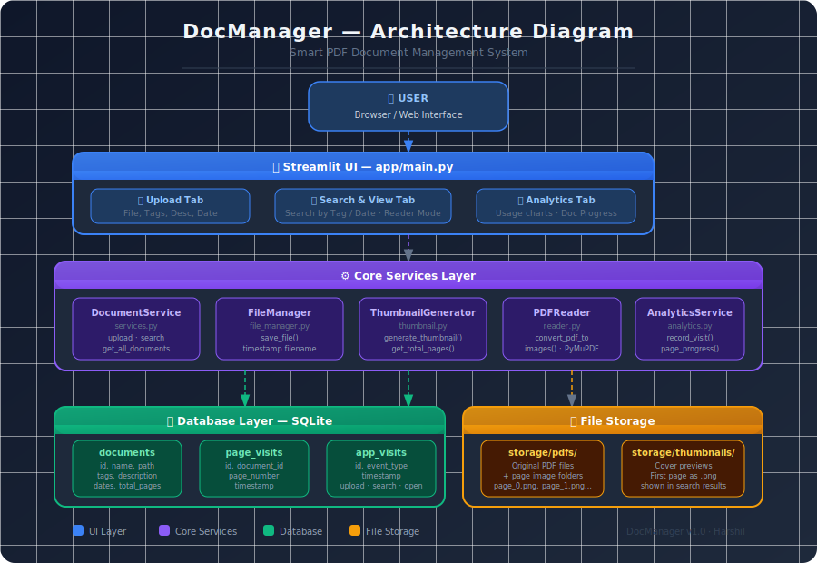

# 📒 DocManager — Smart PDF Document Manager

> A smart, searchable PDF management system built with **Streamlit** and **PyMuPDF**.  
> Upload PDFs with tags, descriptions, and dates — then find them instantly.

---

## 🚀 Features

- 📤 **Upload PDFs** with tags, description, and optional lecture date
- 🔍 **Smart Search** by tag or date
- 📖 **Built-in PDF Reader** with page-by-page navigation
- 🖼️ **Auto Thumbnails** generated from the first page of each PDF
- 📊 **Analytics Dashboard** — tracks uploads, searches, opens & reading progress
- 🔐 **Admin Controls** — password-protected database reset
- 🗄️ **SQLite Storage** — lightweight, no external DB needed

---

## 🏗️ Architecture



The project follows a clean layered architecture:

| Layer | Files | Responsibility |
|---|---|---|
| **UI Layer** | `app/main.py` | Streamlit tabs: Upload, Search & View, Analytics |
| **Core Services** | `core/services.py` | Orchestrates upload pipeline |
| **File Manager** | `core/file_manager.py` | Saves PDFs with timestamped filenames |
| **PDF Reader** | `core/reader.py` | Converts PDF pages to images via PyMuPDF |
| **Thumbnail** | `core/thumbnail.py` | Generates cover thumbnail from page 1 |
| **Analytics** | `core/analytics.py` | Tracks user events and reading progress |
| **Data Models** | `core/models.py` | Document dataclass |
| **Database** | `db/database.py` | SQLite init and connection |
| **Repository** | `db/repository.py` | CRUD queries for documents |

---

## 📁 Project Structure

```
DOCMANAGER/
├── app/
│   └── main.py              # Streamlit UI (3 tabs)
├── core/
│   ├── models.py            # Document data model
│   ├── services.py          # Upload & search logic
│   ├── file_manager.py      # PDF file saving
│   ├── reader.py            # PDF to image conversion
│   ├── thumbnail.py         # Thumbnail generation
│   └── analytics.py        # Event & progress tracking
├── db/
│   ├── database.py          # DB connection & schema init
│   └── repository.py        # SQL queries
├── data/
│   └── documents.db         # SQLite database (auto-created)
├── storage/
│   ├── pdfs/                # Uploaded PDFs + page images
│   └── thumbnails/          # Cover thumbnails
├── .env.example             # Environment variable template
├── requirements.txt         # Python dependencies
├── pyproject.toml           # Project config
└── README.md
```

---

## Setup & Installation

### 1. Clone the repository
```bash
git clone https://github.com/YOUR_USERNAME/DOCMANAGER.git
cd DOCMANAGER
```

### 2. Create a virtual environment
```bash
python -m venv .venv

# Windows
.venv\Scripts\activate

# macOS / Linux
source .venv/bin/activate
```

### 3. Install dependencies
```bash
pip install -r requirements.txt
```

### 4. Set up environment variables
```bash
cp .env.example .env
# Edit .env and set your admin password
```

### 5. Create required folders
```bash
mkdir -p storage/pdfs storage/thumbnails data
```

### 6. Run the app
```bash
streamlit run app/main.py
```

Open your browser at **http://localhost:8501**

---

## Usage

**Upload Tab** — Select a PDF, add tags (comma-separated), a description, and an optional lecture date. Hit Upload and the thumbnail is auto-generated.

**Search & View Tab** — Search by tag (partial match) or lecture date. Click Open to enter Reader Mode with page navigation and a reading progress bar.

**Analytics Tab** — Bar chart of all user events plus a per-document reading progress table.

---

## Tech Stack

| Technology | Version | Purpose |
|---|---|---|
| Python | 3.14 | Core language |
| Streamlit | 1.57.0+ | Web UI framework |
| PyMuPDF (fitz) | 1.27.2.2 | PDF processing & image export |
| SQLite | Built-in | Document metadata storage |
| python-dotenv | 1.2.2+ | Environment variable management |
| Pandas | Latest | Analytics data display |

---

## Acknowledgements

Built as part of the **Ultimate Data Science Bootcamp (UDS 2.0)** by [Krish Naik](https://www.youtube.com/@krishnaik06).

---

## License

This project is open source and available under the [MIT License](LICENSE).
